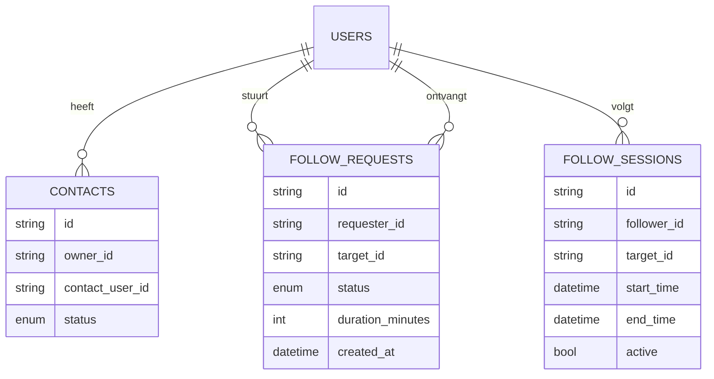
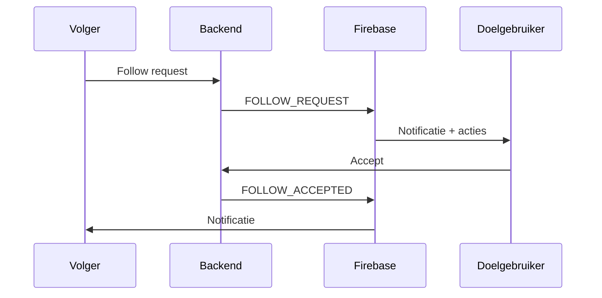
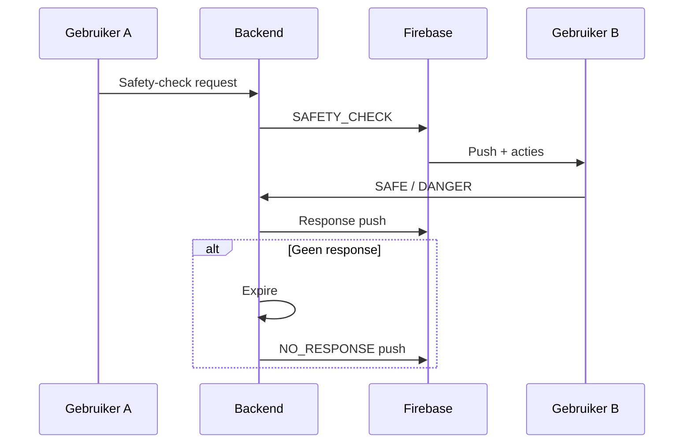
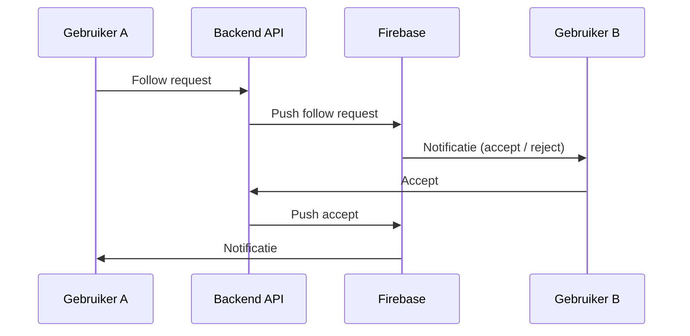

# Backend Architectuur – MyGuardian

Dit document beschrijft de huidige backend-architectuur met focus op **Follow requests** en **Follow sessions**. Alle teksten zijn in het Nederlands, zoals afgesproken.

---

## 1. Overzicht

De backend is opgezet als een **modulaire FastAPI-applicatie**, containerized met Docker, en bedoeld als veilige communicatielaag tussen gebruikers van de Safety App.

Belangrijke uitgangspunten:

* Privacy-first
* Expliciete toestemming
* Tijdgebonden toegang
* Volledig herstelbaar na app- of server-restart

---

## 2. Hoofdcomponenten

### Technologie

* **FastAPI** – REST API
* **PostgreSQL** – persistente opslag
* **SQLAlchemy (async)** – ORM
* **JWT** – authenticatie
* **Docker** – deployment & development

---

## 3. Domeinconcepten

### Gebruiker (User)

Een geregistreerde app-gebruiker met unieke ID.

### Contact

Een expliciete relatie tussen twee gebruikers (invite / accept / block).

### Follow request

Een tijdelijk verzoek om iemand te mogen volgen.

### Follow session

Een actieve, tijdgebonden volg-sessie tussen twee gebruikers.

---

## 4. Follow requests

### Doel

Een gebruiker (volger) vraagt toestemming aan een andere gebruiker (doelpersoon) om deze te volgen gedurende een beperkte tijd.

### Eigenschappen

* Expliciete acceptatie vereist
* Tijdslimiet: 1u / 2u / 4u / 8u
* Alleen mogelijk tussen **geaccepteerde contacten**

### Statussen

* `PENDING`
* `ACCEPTED`
* `REJECTED`
* `EXPIRED`

---

## 5. Follow sessions

### Doel

Na acceptatie ontstaat een **actieve follow session**.

### Gedrag

* Alleen actief binnen tijdsperiode
* Automatisch beëindigd na verloop
* Kan handmatig worden gestopt
* Wordt hersteld bij app-herstart

---

## 6. Datamodel

### Tabellen

* users
* contacts
* follow_requests
* follow_sessions

---

## 7. Relationeel diagram (Mermaid)



---

## 8. API-overzicht (Follow)

### Follow request sturen

`POST /follow/request`

### Follow request accepteren

`POST /follow/accept`

### Follow request weigeren

`POST /follow/reject`

### Actieve follow sessions

`GET /follow/sessions`

### Follow session stoppen

`POST /follow/stop`

---

## 9. Beveiliging

* Alleen JWT-authenticated users
* Alleen ACCEPTED contacten
* Directionele controle (wie volgt wie)
* Tijdslimieten enforced server-side

---

## 10. Herstel na app-herstart

Bij herstart van de app:

* Client vraagt actieve follow sessions op
* Backend bepaalt geldigheid o.b.v. tijd
* Verlopen sessies worden automatisch beëindigd

---

## 11. Push infrastructuur (Firebase FCM)

### Doel

De push infrastructuur zorgt ervoor dat gebruikers **direct** notificaties ontvangen bij belangrijke gebeurtenissen, zoals follow requests en safety-checks.

### Technologie

* **Firebase Cloud Messaging (FCM)**
* HTTP v1 API
* Device-specifieke FCM tokens

### Opslag

Per gebruiker wordt één of meerdere FCM tokens opgeslagen (bijvoorbeeld per device).

```text
users
 └─ fcm_tokens (1..n)
```

---

## 12. FCM token management

### Doel

Om push-notificaties te kunnen versturen, moet elk device zijn **Firebase Cloud Messaging (FCM) token** registreren bij de backend.

### Eigenschappen

* Een gebruiker kan meerdere devices hebben
* Tokens zijn device-specifiek
* Tokens worden verwijderd bij logout of uninstall

### API endpoints

#### FCM token registreren

`POST /push/token`

Body:

```json
{
  "token": "fcm-token-string"
}
```

Gedrag:

* Token wordt gekoppeld aan ingelogde gebruiker
* Bestaat token al → geen duplicaat

---

#### FCM token verwijderen

`DELETE /push/token`

Body:

```json
{
  "token": "fcm-token-string"
}
```

---

## 13. Push types

### Follow request push

Wordt verstuurd wanneer:

* Een gebruiker een follow request stuurt

Inhoud:

* Naam / ID van aanvrager
* Duur (1u / 2u / 4u / 8u)
* Acties: **Accepteren** / **Weigeren**

---

### Follow accept / reject push

Wordt verstuurd wanneer:

* Een follow request wordt geaccepteerd of geweigerd

Inhoud:

* Status
* Starttijd (bij acceptatie)

---

### Safety-check push

Wordt verstuurd wanneer:

* Een contact expliciet vraagt of je veilig bent

Eigenschappen:

* Vereist response binnen 5 minuten
* Acties in notificatie:

  * "Ik ben veilig"
  * "Ik voel me niet veilig"

---

## 13. Push service abstractie

### Doel

Alle push-logica wordt gecentraliseerd in één **PushService**. Hierdoor blijft de rest van de backend:

* Testbaar
* Onafhankelijk van Firebase
* Eenvoudig uit te breiden

De applicatie praat **nooit direct** met Firebase, maar altijd via deze service.

---

### Architectuur

```text
Router / Use-case
   ↓
PushService (interface)
   ↓
FirebasePushService (implementatie)
```

---

### PushService interface

```python
class PushService:
    async def send_follow_request(self, target_user_id: str, payload: dict):
        raise NotImplementedError

    async def send_follow_response(self, target_user_id: str, payload: dict):
        raise NotImplementedError

    async def send_safety_check(self, target_user_id: str, payload: dict):
        raise NotImplementedError
```

---

### Firebase implementatie

```python
class FirebasePushService(PushService):
    def __init__(self, fcm_client, token_repository):
        self.fcm_client = fcm_client
        self.token_repository = token_repository

    async def _send(self, user_id: str, data: dict):
        tokens = await self.token_repository.get_tokens_for_user(user_id)
        for token in tokens:
            await self.fcm_client.send(token, data)

    async def send_follow_request(self, target_user_id: str, payload: dict):
        await self._send(target_user_id, payload)

    async def send_follow_response(self, target_user_id: str, payload: dict):
        await self._send(target_user_id, payload)

    async def send_safety_check(self, target_user_id: str, payload: dict):
        await self._send(target_user_id, payload)
```

---

### Token repository

```python
class FcmTokenRepository:
    async def get_tokens_for_user(self, user_id: str) -> list[str]:
        ...
```

---

### Mock implementatie (testen)

```python
class MockPushService(PushService):
    def __init__(self):
        self.sent_messages = []

    async def send_follow_request(self, target_user_id, payload):
        self.sent_messages.append((target_user_id, payload))
```

---

### Gebruik in follow request flow

```text
POST /follow/request
 → FollowService
   → PushService.send_follow_request()
```

---

### Waarom deze opzet?

* Firebase kan later worden vervangen
* Pushes zijn unit-testbaar
* Geen Firebase-keys nodig in tests
* Schone scheiding van verantwoordelijkheden

---

## 14. Push payloads & notificatie-acties

In deze stap definiëren we **het contract tussen backend en Android** voor push-notificaties. Dit zorgt ervoor dat notificaties:

* Acties bevatten (buttons)
* Diep kunnen linken naar de juiste schermen
* Betrouwbaar verwerkt kunnen worden, ook bij app-herstart

---

## 15. Push payload structuur

Alle push-berichten gebruiken een uniforme basisstructuur:

```json
{
  "type": "<PUSH_TYPE>",
  "timestamp": "ISO-8601",
  "data": { }
}
```

De Android-app routeert uitsluitend op het veld `type`.

---

## 16. Follow request push

### Type

`FOLLOW_REQUEST`

### Payload

```json
{
  "type": "FOLLOW_REQUEST",
  "timestamp": "2026-02-05T12:00:00Z",
  "data": {
    "request_id": "uuid",
    "requester_id": "uuid",
    "duration_minutes": 120
  }
}
```

### Notificatie-acties

* Accepteren → `POST /follow/accept`
* Weigeren → `POST /follow/reject`

---

## 17. Follow accept / reject push

### Type

* `FOLLOW_ACCEPTED`
* `FOLLOW_REJECTED`

### Payload (accept)

```json
{
  "type": "FOLLOW_ACCEPTED",
  "timestamp": "...",
  "data": {
    "session_id": "uuid",
    "end_time": "ISO-8601"
  }
}
```

---

## 18. Safety-check push

### Type

`SAFETY_CHECK`

### Payload

```json
{
  "type": "SAFETY_CHECK",
  "timestamp": "...",
  "data": {
    "check_id": "uuid",
    "requester_id": "uuid",
    "expires_at": "ISO-8601"
  }
}
```

### Acties

* "Ik ben veilig" → `POST /safety-check/confirm`
* "Ik voel me niet veilig" → `POST /safety-check/danger`

---

## 19. Android notificatie-afhandeling

### Routing

Android handelt push-berichten af via:

```kotlin
when (payload.type) {
  FOLLOW_REQUEST -> showFollowRequestNotification()
  SAFETY_CHECK -> showSafetyCheckNotification()
}
```

### Belangrijk

* Backend is leidend (state komt altijd van API)
* Notificatie-acties zijn idempotent
* UI wordt hersteld via API-calls

---

## 20. Veiligheid & betrouwbaarheid

* Geen gevoelige persoonsgegevens in payload
* UUID's zijn server-side gevalideerd
* Acties altijd opnieuw geverifieerd via JWT
* Push is een trigger, geen bron van waarheid

---

## 21. Samenvattende flow (Mermaid)



---

## 22. Safety-check flow

De safety-check flow stelt gebruikers in staat om actief te controleren of een contact zich veilig voelt, met een verplichte response binnen een vaste tijd.

---

## 23. Safety-check concept

### Doel

Een gebruiker kan een **safety-check** sturen naar een vertrouwd contact om te vragen of alles veilig is.

Eigenschappen:

* Alleen tussen ACCEPTED contacten
* Tijdgebonden (standaard 5 minuten)
* Vereist expliciete bevestiging
* Geen response → automatische escalatie

---

## 24. Datamodel

### SafetyCheck

```python
class SafetyCheck(Base):
    __tablename__ = "safety_checks"

    id: Mapped[str]
    requester_id: Mapped[str]
    target_id: Mapped[str]
    status: Mapped[SafetyCheckStatus]
    created_at: Mapped[datetime]
    expires_at: Mapped[datetime]
    responded_at: Mapped[datetime | None]
```

### Statussen

* PENDING
* SAFE
* DANGER
* NO_RESPONSE

---

## 25. API Endpoints

### Safety-check starten

`POST /safety-check/request`

Start een safety-check en verstuurt een push-notificatie.

---

### Safety-check bevestigen

`POST /safety-check/safe`

---

### Safety-check onveilig

`POST /safety-check/danger`

---

## 26. Countdown & escalatie

* Countdown = 5 minuten
* Backend valideert tijd
* Android toont foreground countdown
* Geen response binnen tijd → status NO_RESPONSE

---

## 27. Escalatiegedrag

Bij NO_RESPONSE:

* Requester ontvangt push
* Contactgegevens (telefoon / NAW) worden beschikbaar
* Volgende stap: noodmodus

---

## 28. Sequence diagram



---

## 29. Samenvatting

De safety-check flow vormt een kritieke veiligheidslaag:

* Actief vragen om bevestiging
* Tijdgebonden
* Escalatie bij geen reactie
* Volledig herleidbaar

Deze flow is de basis voor noodmodus en automatische opvolging.



---

