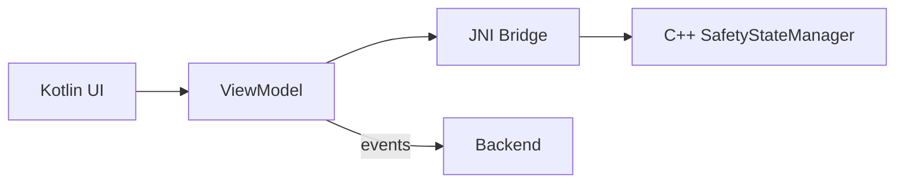

# Architectuur MyGuardian

## Overzicht
MyGuardian bestaat uit drie lagen:
- Android UI (Kotlin, ViewModel)
- Native core (C++ via JNI)
- Backend (FastAPI, optioneel)

```mermaid
flowchart LR
    UI[Kotlin UI] --> VM[ViewModel]
    VM --> JNI[JNI Bridge]
    JNI --> CPP[C++ SafetyStateManager]
    VM -->|events| Backend
```
